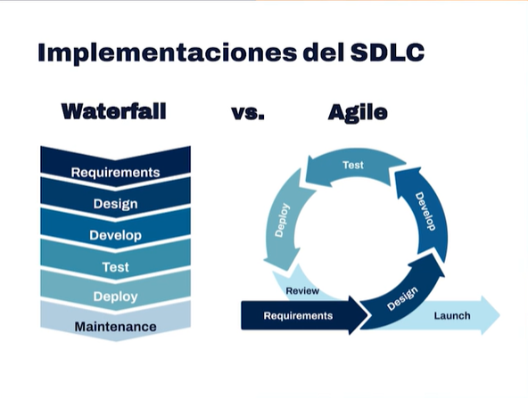

# Ciclo de vida del Desarrollo de Software
Ciclo de vida del Software (SDLC - Software Development Life Cycle)

## El SDLC busca crear Software de Alta calidad, Rápido y Barato

Fases del SDLC:

Planificación/Requisitos 💡💰
Diseño 🎨
Ejecución/Dev 🛠️
Pruebas 🔍
Deploy 🧐🍷
Mantenimiento 💆

Implementaciones del SDLC: Waterfall (Cascada) Y Agile (Iteraciones constantes)

