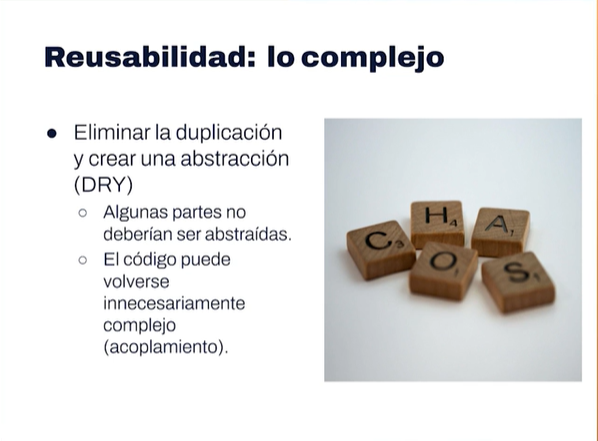
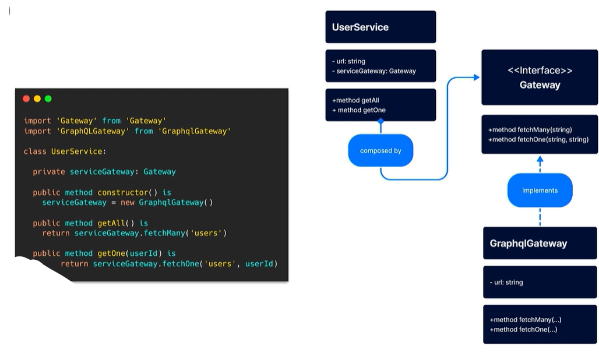

# Elementos de un buen diseño de software
## 1- Diseño de software

### Elementos del Diseño de Software 🎨

UI y UX: Diseño de la interfaz, experiencia del usuario, traducir indicaciones a elementos visibles
Equipo de Ing: Arquitectura, Stack, Team, Tiempo, Metodologías, etc…

### Elementos del buen diseño de Software:

Modularidad
Tolerancia a fallos
Robustez
Seguridad
Usabilidad
Reusabilidad
Extensibilidad (que si se añade más código, no afecte al código previo)

### Tipos de diseño

Al momento de construir aplicaciones hay dos tipos de perspectivas de diseño:

- La perspectiva del equipo de UX/UI (Diseño de interfaz y experiencia del usuario, requerimientos, colores, botones, etc.)

- La perspectiva del equipo de Ingeniería (Arquitectura, cantidad de personas en el equipo, esfuerzo en iteraciones, metodología, tiempos, etc.)

### Características de un buen diseño
Desde la perspectiva del equipo de ingeniería.

- La modularidad (Pedazos de software que funcionan como código cuyas responsabilidades están bien delimitadas).

- Tolerancia a fallo (Capacidades para solucionar problemas que se puedan presentar en el funcionamiento de la aplicación).

- Robustez (Funcionamiento de la aplicación ante situaciones de estrés como memoria insuficiente, bases de datos llenas, peticiones altas, etc.)

- Seguridad (Políticas de seguridad, credenciales, accesos, etc.)

- Usabilidad(La interfaz cumple su labor? Abarca todos los casos de Uso?)

- Reusabilidad (Reusar piezas de software y crecimiento del mismo)

- Extensibilidad (Capacidad de integrar nuevos cambios sin tener que modificar lo ya existente)

## 2- Reusabilidad

### Reusabilidad:

Reduce: Costo y tiempo
Beneficia a otras áreas
Innovaciones e iteraciones
pero…
No siempre es ideal
Puede generar complejidad

### Niveles de Reusabilidad:

- Primer nivel: Clases y funciones (la expresión mínima de un programa)
- Segundo nivel: Patrones de diseño (pueden variar)
- Tercer nivel: Frameworks (facilitarse la vida)

## 3- Extensibilidad

### Extensibilidad:

- Cambios sencillos y comprensibles
- Cambios por contrato y/o interfaz
requiere…
- Comprender el problema
- Consenso en la norma estándar

El chiste está en iterar, rápido, sencillo y con amplios márgenes de mejora

### Interfaz
Estipula las reglas que, las clases que lo implementen, tienen que seguir.
En este sentido, una interfaz puede entenderse como un contrato abstracto que establece el comportamiento esperado del componente que la implementa, así como las restricciones, requisitos y formatos de entrada y salida que deben cumplirse.
