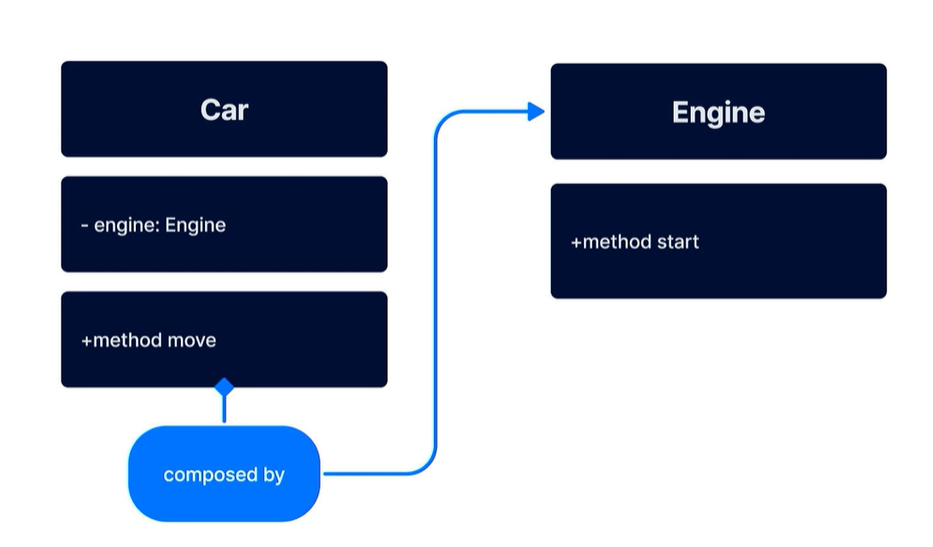

# POO y patrones de diseño

## POO usa objetos que tienen propiedades y comportamientos

### Se basa en 4 pilares:

- Abstracción: Pasar comportamiento real a código
- Encapsulación: Cada abstracción realiza una tarea con prioridades únicas
- Herencia: qué el código hijo herede ciertas propiedades del mayor
- Polimorfismo: es la capacidad del código hijo de modificar el comportamiento heredado

### Herencia y composición

Herencia:

- La subclase y la superclase está unidas
- La subclase no puede ordenarle a la superclase
- Para reusar código podemos crear clases intermedias, para reutilizarlas en las distintas subclases

Composición: Es una relación entre 2 clases dónde una necesita de otra para funcionar.

- “Carro” necesita “Motor” para funcionar

## Relaciones entre clases

UML (Unified Model Language): Es mostrar visualmente el comportamiento y la estructura de un sistema, normalmente, a través de diagramas

-Relación de dependencia: Se da cuándo al realizar cambios en una clase se modifica otra

Relación de asociación: Se da cuándo una clase tiene acceso permanente a otra clase

Relación de implementación: Se da cuándo una clase define su comportamiento basado en cierto método

Relación de herencia: Similar a la anterior, pero puede extender su comportamiento

Relación de agregación: Se da cuándo una clase necesita de otras clases, pero no interfiere en su creación o eliminación. Simplemente las añade mientras sean útiles

Relación de composición: Se da cuándo una clase necesita de otras clases, pero interfiere en su creación y eliminación. Así mismo si el elemento mayor desaparece, las demás clases dejan de ser útiles